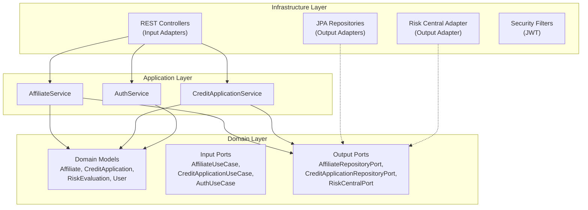
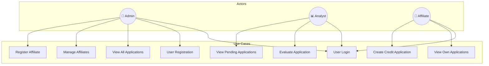

# CoopCredit - Integral Credit Application System

A professional credit application management system built with **Hexagonal Architecture**, **Spring Boot 3.2**, **JWT Security**, and **Microservices** containerized with **Docker**.

---

## 📋 Table of Contents

- [Project Description](#-project-description)
- [Architecture](#-architecture)
- [Technologies Used](#-technologies-used)
- [Project Structure](#-project-structure)
- [Installation and Execution](#-installation-and-execution)
- [API Endpoints](#-api-endpoints)
- [Security and Roles](#-security-and-roles)
- [Testing](#-testing)
- [Observability](#-observability)
- [Docker](#-docker)
- [Postman Collection](#-postman-collection)

---

## 🎯 Project Description

**CoopCredit** is a credit cooperative that manages credit applications for its affiliates. This system provides:

- ✅ Affiliate registration and management
- ✅ Credit application creation and evaluation
- ✅ External risk assessment service integration
- ✅ Role-based access control (Affiliate, Analyst, Admin)
- ✅ JWT Authentication
- ✅ RFC 7807 error handling (ProblemDetail)
- ✅ Observability with Spring Actuator and Micrometer
- ✅ Full containerization with Docker

---

## 🏗️ Architecture

### Hexagonal Architecture (Ports & Adapters)



### Microservices Architecture

```mermaid
graph LR
    subgraph "Docker Compose Network"
        CLIENT[("Client<br/>(Postman/Browser)")]
        
        subgraph "credit-application-service :8080"
            API["REST API"]
            SEC2["JWT Security"]
            BUS["Business Logic"]
        end
        
        subgraph "risk-central-mock :8081"
            RISK["Risk Evaluation<br/>Endpoint"]
        end
        
        DB[(("PostgreSQL<br/>:5432"))]
    end
    
    CLIENT -->|HTTP| API
    API --> SEC2
    SEC2 --> BUS
    BUS -->|REST| RISK
    BUS -->|JDBC| DB
```

### Use Case Diagram



---

## 🛠️ Technologies Used

| Category | Technology | Version |
|----------|------------|---------|
| **Language** | Java | 21 |
| **Framework** | Spring Boot | 3.2.5 |
| **Security** | Spring Security + JWT | jjwt 0.12.5 |
| **Persistence** | Spring Data JPA + PostgreSQL | 15 |
| **Migrations** | Flyway | 10.10.0 |
| **Mapping** | MapStruct | 1.5.5 |
| **Documentation** | SpringDoc OpenAPI | 2.5.0 |
| **Observability** | Spring Actuator + Micrometer | - |
| **Containers** | Docker + Docker Compose | - |
| **Testing** | JUnit 5 + Testcontainers | 1.20.4 |

---

## 📁 Project Structure

```
prueba_spring_boot/
├── docker-compose.yml
├── pom.xml (parent)
├── README.md
├── postman/
│   └── CoopCredit.postman_collection.json
│
├── credit-application-service/          # Main microservice
│   ├── Dockerfile
│   ├── pom.xml
│   └── src/
│       ├── main/java/com/coopcredit/
│       │   ├── domain/                   # 🟢 DOMAIN LAYER (no dependencies)
│       │   │   ├── model/               # Pure domain entities
│       │   │   │   ├── Affiliate.java
│       │   │   │   ├── CreditApplication.java
│       │   │   │   ├── RiskEvaluation.java
│       │   │   │   ├── User.java
│       │   │   │   └── enums/
│       │   │   ├── port/
│       │   │   │   ├── input/           # Input ports (Use Cases)
│       │   │   │   └── output/          # Output ports (Repositories)
│       │   │   └── exception/           # Domain exceptions
│       │   │
│       │   ├── application/              # 🟡 APPLICATION LAYER
│       │   │   ├── service/             # Use Case implementations
│       │   │   │   ├── AffiliateService.java
│       │   │   │   ├── CreditApplicationService.java
│       │   │   │   └── AuthService.java
│       │   │   └── dto/                 # Data Transfer Objects
│       │   │
│       │   └── infrastructure/           # 🔵 INFRASTRUCTURE LAYER
│       │       ├── adapter/
│       │       │   ├── input/rest/      # REST Controllers
│       │       │   └── output/
│       │       │       ├── persistence/ # JPA Entities + Repositories
│       │       │       └── external/    # Risk Central Adapter
│       │       ├── config/              # Spring configurations
│       │       └── security/            # JWT + Spring Security
│       │
│       └── resources/
│           ├── application.yml
│           └── db/migration/            # Flyway migrations
│               ├── V1__create_tables.sql
│               ├── V2__create_credit_tables.sql
│               └── V3__initial_data.sql
│
└── risk-central-mock-service/           # Mock risk evaluation microservice
    ├── Dockerfile
    ├── pom.xml
    └── src/main/java/com/coopcredit/risk/
        ├── RiskCentralMockApplication.java
        ├── controller/RiskEvaluationController.java
        ├── service/RiskCalculatorService.java
        └── dto/
```

---

## 🚀 Installation and Execution

### Prerequisites

- **Java 21** or higher
- **Maven 3.9+**
- **Docker** and **Docker Compose**

### Option 1: Run with Docker Compose (Recommended)

```bash
# Clone the repository
git clone <repository-url>
cd prueba_spring_boot

# Build and run all services
docker compose up -d --build

# Verify services are running
docker compose ps
```

### Option 2: Local Execution

```bash
# 1. Start PostgreSQL (if you don't have Docker)
# Configure database: coopcredit, user: coopcredit, password: coopcredit123

# 2. Build the project
mvn clean install -DskipTests

# 3. Run risk-central-mock
cd risk-central-mock-service
mvn spring-boot:run &

# 4. Run credit-application-service
cd ../credit-application-service
mvn spring-boot:run
```

### Verify Installation

```bash
# Health check
curl http://localhost:8080/actuator/health

# Login
curl -X POST http://localhost:8080/auth/login \
  -H "Content-Type: application/json" \
  -d '{"username":"admin","password":"password"}'
```

---

## 📡 API Endpoints

### Authentication

| Method | Endpoint | Description | Roles |
|--------|----------|-------------|-------|
| `POST` | `/auth/login` | User login | Public |
| `POST` | `/auth/register` | User registration | Public |

### Affiliates

| Method | Endpoint | Description | Roles |
|--------|----------|-------------|-------|
| `GET` | `/api/affiliates` | List all affiliates | ADMIN |
| `GET` | `/api/affiliates/{id}` | Get affiliate by ID | ADMIN, ANALYST |
| `POST` | `/api/affiliates` | Register new affiliate | ADMIN |
| `PUT` | `/api/affiliates/{documentNumber}` | Update affiliate | ADMIN |
| `DELETE` | `/api/affiliates/{documentNumber}` | Deactivate affiliate | ADMIN |
| `PATCH` | `/api/affiliates/{documentNumber}/activate` | Activate affiliate | ADMIN |

### Credit Applications

| Method | Endpoint | Description | Roles |
|--------|----------|-------------|-------|
| `POST` | `/api/applications` | Create application | AFFILIATE, ADMIN |
| `GET` | `/api/applications/{id}` | Get application | AFFILIATE, ANALYST, ADMIN |
| `GET` | `/api/applications` | List all | ADMIN |
| `GET` | `/api/applications/pending` | List pending | ANALYST, ADMIN |
| `GET` | `/api/applications/affiliate/{doc}` | Applications by affiliate | AFFILIATE*, ANALYST, ADMIN |
| `POST` | `/api/applications/{id}/evaluate` | Evaluate application | ANALYST, ADMIN |

> *AFFILIATE can only view their own applications

### Swagger UI

Interactive documentation available at: `http://localhost:8080/swagger-ui.html`

---

## 🔐 Security and Roles

### Role System

| Role | Permissions |
|------|-------------|
| **ROLE_ADMIN** | Full access to all functionalities |
| **ROLE_ANALYST** | View pending applications, evaluate |
| **ROLE_AFFILIATE** | Create applications, view only their own applications |

### Default Users

| Username | Password | Role |
|----------|----------|------|
| `admin` | `password` | ADMIN |
| `analyst` | `password` | ANALYST |
| `affiliate1` | `password` | AFFILIATE |

### JWT Authentication

```bash
# 1. Get token
TOKEN=$(curl -s -X POST http://localhost:8080/auth/login \
  -H "Content-Type: application/json" \
  -d '{"username":"admin","password":"password"}' | jq -r '.token')

# 2. Use token in requests
curl -H "Authorization: Bearer $TOKEN" http://localhost:8080/api/affiliates
```

---

## 🧪 Testing

### Run Unit Tests

```bash
cd prueba_spring_boot
mvn test -pl credit-application-service
```

### Run All Tests (including integration)

```bash
# Requires Docker running
mvn test -pl credit-application-service -Dtestcontainers.enabled=true
```

### Test Coverage

| Suite | Tests | Description |
|-------|-------|-------------|
| `CreditApplicationServiceTest` | 7 | Credit business logic |
| `AffiliateServiceTest` | 6 | Affiliate business logic |
| `IntegrationTest` | 5 | REST + DB integration tests |
| **Total** | **18** | ✅ |

### Testcontainers Requirement

If you have Docker 28.x or higher, you need to create this file:

```bash
echo "api.version=1.44" > ~/.docker-java.properties
```

---

## 📊 Observability

### Spring Actuator Endpoints

| Endpoint | Description |
|----------|-------------|
| `/actuator/health` | Service health status |
| `/actuator/info` | Application information |
| `/actuator/metrics` | Available metrics |
| `/actuator/prometheus` | Prometheus format metrics |

### Custom Metrics (Micrometer)

```bash
# View credit application metrics
curl http://localhost:8080/actuator/metrics/credit.applications.created
curl http://localhost:8080/actuator/metrics/credit.applications.evaluated

# View authentication metrics
curl http://localhost:8080/actuator/metrics/auth.login

# Prometheus format
curl http://localhost:8080/actuator/prometheus | grep -E "credit_|auth_"
```

**Implemented metrics:**
- `credit.applications.created` - Counter of created applications
- `credit.applications.evaluated{result=approved|rejected}` - Evaluation counter
- `auth.login{result=success|failure}` - Login attempt counter
- `affiliates.registered` - Registered affiliates counter

### Structured Logging (JSON)

Logs are emitted in JSON format for easy integration with centralized logging systems:

```json
{
  "timestamp": "2025-12-09T16:35:28,508",
  "level": "INFO",
  "logger": "c.c.a.s.CreditApplicationService",
  "message": "Credit application created with ID: 1",
  "thread": "main"
}
```

---

## 🐳 Docker

### Services

| Service | Port | Description |
|---------|------|-------------|
| `credit-service` | 8080 | Main service |
| `risk-central` | 8081 | Risk evaluation mock |
| `db` | 5432 | PostgreSQL |

### Useful Commands

```bash
# Start services
docker compose up -d

# View logs
docker compose logs -f credit-service

# Stop services
docker compose down

# Rebuild and restart
docker compose down -v && docker compose build --no-cache && docker compose up -d

# Check container status
docker compose ps
```

### Health Checks

Services include automatic health checks:
- PostgreSQL: `pg_isready`
- Risk Central: `curl http://localhost:8081/health`
- Credit Service: Spring Actuator `/actuator/health`

---

## 📬 Postman Collection

The Postman collection includes all endpoints organized by category.

### Import Collection

1. Open Postman
2. File → Import
3. Select `postman/CoopCredit.postman_collection.json`

### Collection Variables

| Variable | Default Value |
|----------|---------------|
| `base_url` | `http://localhost:8080` |
| `token` | Automatically updated on login |

---

## 📝 Business Rules

### Credit Evaluation

A credit application is **APPROVED** if it meets all conditions:

1. ✅ **Risk level**: Cannot be HIGH (score >= 600)
2. ✅ **Maximum amount**: Cannot exceed 12 times the affiliate's salary
3. ✅ **Affiliation time**: Minimum 6 months
4. ✅ **Debt-to-income ratio**: Maximum 40%
5. ✅ **Affiliate status**: Must be ACTIVE

### Risk Service (Risk Central Mock)

The risk service evaluates credit score based on:
- Affiliate document hash (for consistency)
- Requested amount
- Term in months

**Risk Levels:**
- 🟢 **LOW** (score >= 700): Low risk
- 🟡 **MEDIUM** (score 500-699): Medium risk
- 🔴 **HIGH** (score < 500): High risk

---

## 👨‍💻 Author

Project developed as part of the Spring Boot performance exam.

---

## 📄 License

This project is for educational purposes.
